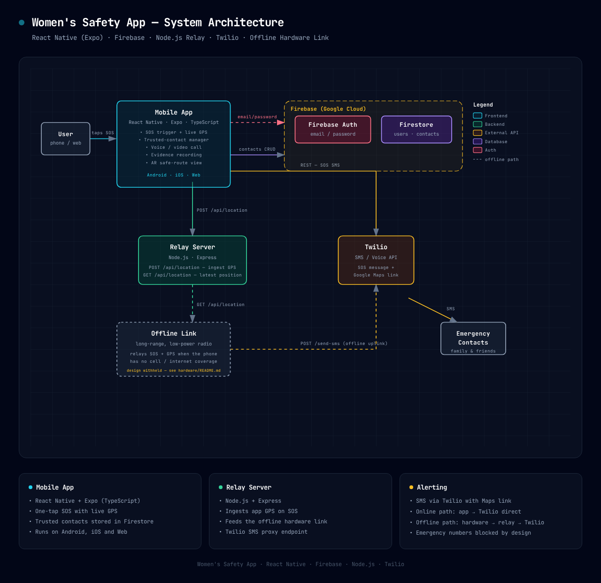
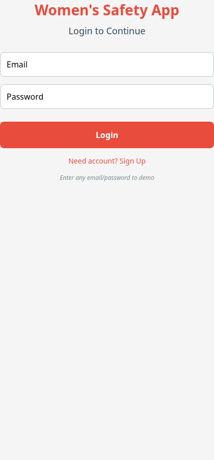
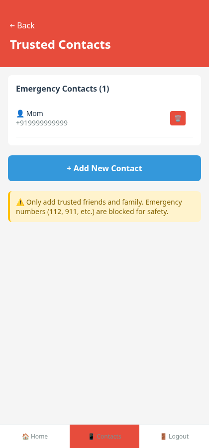
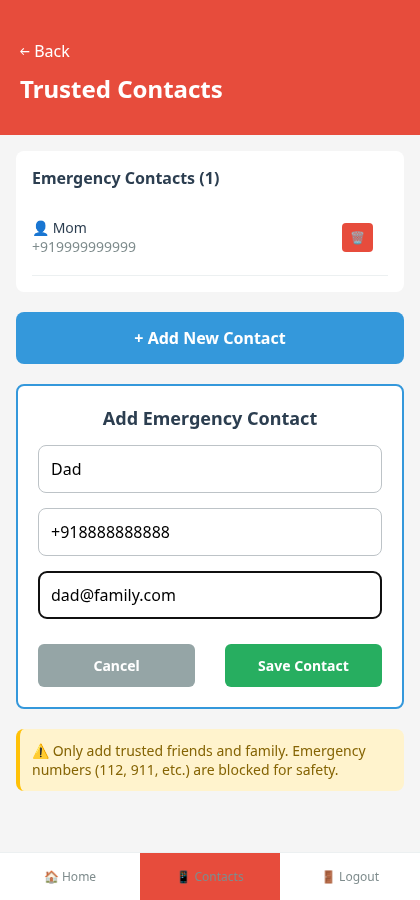
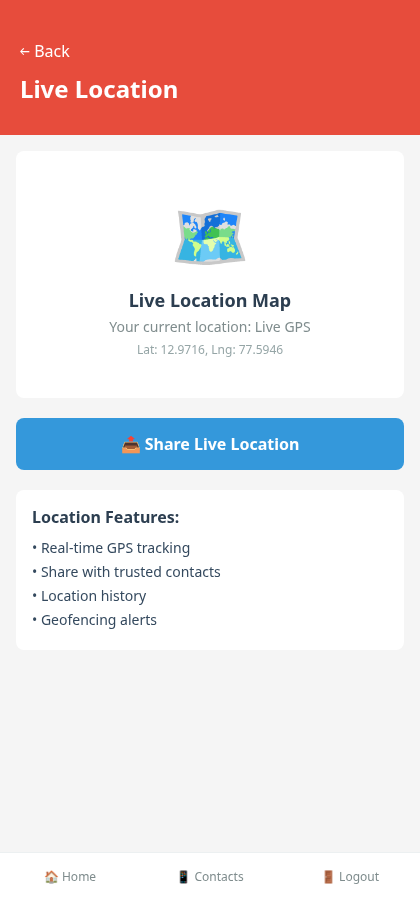
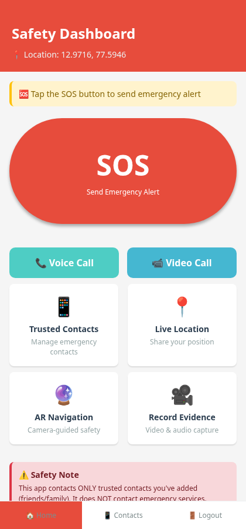

# 🛡️ Women's Safety App

A cross-platform personal safety application built with **React Native (Expo)**, **Firebase**, and **Twilio** — with a unique **offline communication link** that can deliver SOS alerts and live GPS location to trusted contacts even when the phone has **no cellular or internet coverage**.



## ✨ Features

| Feature | Description |
|---|---|
| 🚨 **One-tap SOS** | Sends an emergency alert with a live Google Maps location link to every trusted contact |
| 📡 **Offline SOS relay** | Proprietary long-range low-power hardware link delivers SOS + GPS when there's no network — designed for wilderness, disaster and no-coverage scenarios |
| 👥 **Trusted contacts** | Add/remove emergency contacts (friends & family). Emergency numbers (112, 100, 911…) are **blocked by design** |
| 📍 **Live location** | Real-time GPS position display and sharing |
| 📞 **Voice / Video call** | Direct call actions to first trusted contact |
| 🎥 **Evidence recording** | Video & audio capture for documentation |
| 🔮 **AR safe-route view** | Camera-guided navigation assistance |
| 🔐 **Firebase Auth** | Secure email/password authentication |

## 🏗️ Architecture

```
┌─────────────┐     email/password     ┌──────────────────────────┐
│  Mobile App │ ─────────────────────► │  Firebase                │
│  React Native│    contacts CRUD       │  · Auth                  │
│  + Expo     │ ─────────────────────► │  · Firestore             │
│             │                        └──────────────────────────┘
│  SOS flow:  │  POST /api/location
│             │ ────────────┐
└─────────────┘             ▼
     │              ┌──────────────┐        ┌──────────┐   SMS    ┌─────────┐
     │  REST (online)│ Relay Server │──────► │  Twilio  │ ───────► │ Family  │
     └─────────────► │  Node.js     │        │  API     │          │ &Friends│
                    └──────┬───────┘        └──────────┘          └─────────┘
                           ▲
                           │ HTTP contract
                    ┌──────┴───────┐
                    │ Offline Link │  (proprietary hardware —
                    │ radio module │   design withheld, see
                    └──────────────┘   hardware/README.md)
```

- **Online path** — the app sends SOS SMS through the Twilio REST API directly.
- **Offline path** — the phone's GPS is relayed through the Node.js server to an offline radio module, which triggers SMS alerts over the available uplink when the phone itself has no coverage.

Full diagram: [`docs/architecture.png`](docs/architecture.png) (interactive: [`docs/architecture.html`](docs/architecture.html))

## 📱 Screenshots

| | | |
|---|---|---|
|  |  |  |
| Login | Safety Dashboard | Trusted Contacts |
|  |  |  |
| Add Contact | Live Location | SOS Alert (test mode) |

## 🧰 Tech Stack

- **Frontend:** React Native · Expo SDK 54 · TypeScript
- **Backend:** Node.js · Express (relay server)
- **Database & Auth:** Firebase (Firestore, Firebase Auth)
- **Messaging:** Twilio SMS API
- **Hardware:** custom long-range low-power radio link *(proprietary)*

## 📂 Project Structure

```
women-safety-app/
├── App.tsx                 # Main app: screens, navigation, SOS flow
├── index.ts                # Entry point
├── src/
│   ├── components/         # ARCamera, etc.
│   ├── hooks/              # useAuth — Firebase auth state
│   └── services/           # firebase, location, sms, calling,
│                           # recording, navigation, ar-navigation
├── server/                 # Node.js relay server (GPS + SMS proxy)
├── hardware/               # Offline link (interface contract only)
├── docs/                   # Architecture, screenshots, build guide
├── assets/                 # App icons & splash images
└── .env.example            # Environment variable template
```

## 🚀 Getting Started

### Prerequisites

- Node.js ≥ 18
- A Firebase project (Auth + Firestore enabled)
- A Twilio account (for real SMS)
- Expo Go app on your phone (or a browser for web)

### 1. Clone & install

```bash
git clone https://github.com/Coderr1326/women-safety-app.git
cd women-safety-app
npm install
```

### 2. Configure environment

```bash
cp .env.example .env
# fill in your Firebase + Twilio credentials
```

> `EXPO_PUBLIC_TEST_MODE=true` keeps SOS in demo mode (alerts logged to
> console, no real SMS). Set to `false` only when you're ready for live
> alerts.

### 3. Run the relay server

```bash
cd server
npm install express cors twilio
TWILIO_SID=... TWILIO_AUTH_TOKEN=... node server.js
```

### 4. Run the app

```bash
npx expo start
```

Then scan the QR with Expo Go (Android/iOS) or press `w` for the web version.

## 🔒 Safety & Ethics

- The app contacts **only user-added trusted contacts** — never emergency services
- Official emergency numbers (112, 100, 101, 108, 911…) are blocked with a warning
- SOS defaults to test mode so no accidental real alerts during development

## 📄 License

MIT — see [LICENSE](LICENSE)
